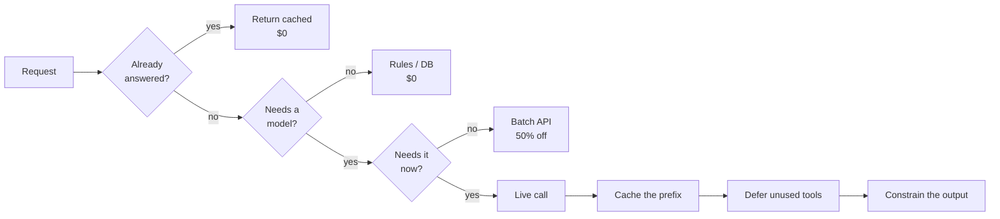

# How to Cut API Costs Without Compromising Agent Reliability

Talk and live demos — **August 19**, Africa's Talking.

Two working demos measuring LLM cost optimization against real providers, plus
four more levers covered in slides. Every number in this repo came back from an
API `usage` field. Nothing is estimated.

| | |
|---|---|
| **Demo 1** | Prompt caching — 97.9% cache hit rate, **73% cost reduction** (Qwen) |
| **Demo 2** | MCP tool loading — 20,184 → 1,815 tokens, **79% cost reduction** (Claude Sonnet 5) |

---

## What is in here

```
backend/    Express + TypeScript API. Prompt caching and MCP tooling demos.
frontend/   Next.js + shadcn UI. Monochrome, built to present from.
```

**Backend** exposes two demo APIs:

- `/api/prompt-caching` — runs the same question with no cache, implicit cache,
  or an explicit `cache_control` breakpoint, and reports the token split back.
- `/api/mcp-tooling` — connects to four live MCP servers (Exa, Firecrawl,
  Context7, AWS Documentation — 35 tools) and runs the same question with all
  tool definitions loaded versus deferred behind tool search.

**Frontend** presents both as click-through demos with live token and cost
readouts.

---

## Running it

Requires Node 22+, pnpm, and API keys for whichever provider you point at.

```bash
# backend
cd backend
pnpm install
cp .env.example .env      # then fill in your keys
pnpm dev                  # http://localhost:4000

# frontend, in a second terminal
cd frontend
pnpm install
pnpm dev                  # http://localhost:3000
```

### Environment

Copy `backend/.env.example` to `backend/.env` and fill in what you need. Nothing
is required at boot — the app only errors when you call a route whose provider
key is missing.

| Variable | Used for |
|---|---|
| `ANTHROPIC_API_KEY` | MCP tooling demo (required for section 02) |
| `QWEN_API_KEY`, `QWEN_BASE_URL` | Prompt caching demo against Qwen |
| `LLM_PROVIDER` | `qwen` or `anthropic` — which provider section 01 uses |
| `MCP_MODEL_ID` | Defaults to `claude-sonnet-5` |
| `EXA_API_KEY`, `FIRECRAWL_API_KEY`, `CONTEXT7_KEY` | MCP servers. Context7 and AWS Documentation work without a key |

`QWEN_BASE_URL` contains your own Model Studio workspace ID — the example file
ships a placeholder.

> **Running the demos costs real money.** Section 02 calls the Anthropic API with
> ~20k input tokens on the naive path, roughly $0.22 per comparison run on
> Sonnet 5. Section 01 against Qwen is a fraction of a cent.

---

## Reproducing the numbers

```bash
# prompt caching: no cache vs implicit vs explicit
curl -X POST localhost:4000/api/prompt-caching/compare \
  -H 'content-type: application/json' -d '{}'

# MCP tooling: all tools loaded vs tool search
curl -X POST localhost:4000/api/mcp-tooling/compare \
  -H 'content-type: application/json' \
  -d '{"question":"What does AWS documentation say about S3 bucket versioning?"}'
```

Both return the full token split, per-mode cost, and the delta between modes.

---


Six levers, ordered by how much they save relative to how hard they are to ship.
Two are live demos in this repo; four are slide material.

> **The whole talk in one sentence:** there are only three ways to cut LLM cost —
> send fewer tokens, pay less per token, or don't send the request at all.
> Everything below is one of those three.



---

## The full write-up

**[TALK.md](TALK.md)** is the substance: all six cost levers, what each one
saves, how they compose, and the order to apply them in — with diagrams and
links to every primary source.

| Lever | | |
|---|---|---|
| 1 | Prompt caching | Live demo in this repo |
| 2 | MCP tool loading | Live demo in this repo |
| 3 | Output discipline | Output is billed at 5x input |
| 4 | Don't send the request | Response and semantic caching |
| 5 | Batch API | 50% off, one flag |
| 6 | Context lifecycle | Editing, compaction, programmatic tool calling |

It also covers why **model routing** is mentioned but not demoed, and two
failure modes worth knowing: Qwen's implicit cache makes a naive before/after
read as a *loss*, and Qwen returns HTTP 200 for `defer_loading` while silently
ignoring it.

---

## Demo runbook

**Section 01 — Prompt caching** (Qwen)
The first explicit call pays the 1.25x cache write and shows a 0% hit rate.
Click a question twice before switching modes.

**Section 02 — MCP tooling** (Anthropic)
Run the *same* question in both modes to reveal the side-by-side card. The two
modes may pick different tools — search surfaces a relevant set, not an
identical one. The first-turn measurement is taken before any tool runs, so the
comparison stays valid.

---

## License

Apache License 2.0 — see [LICENSE](LICENSE).
