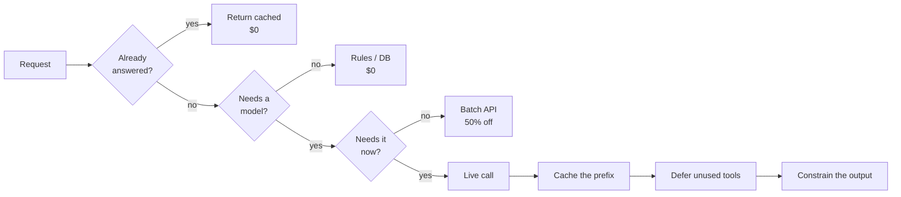
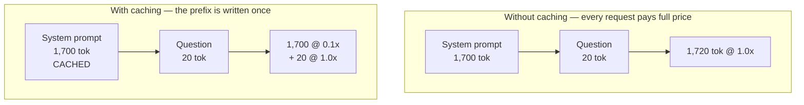
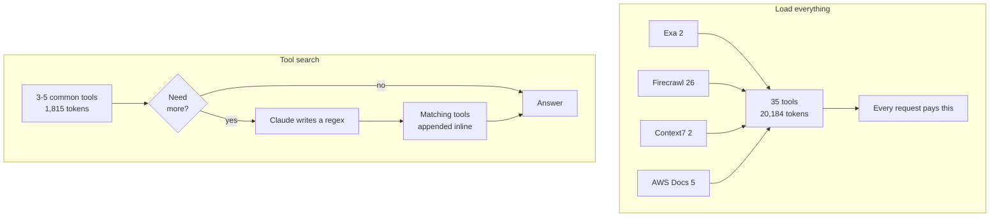
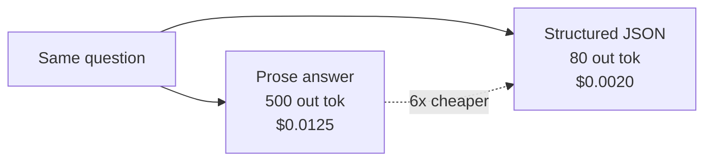
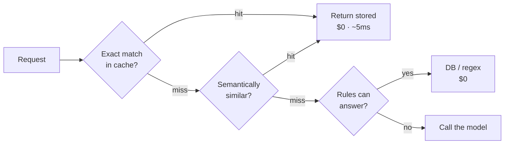
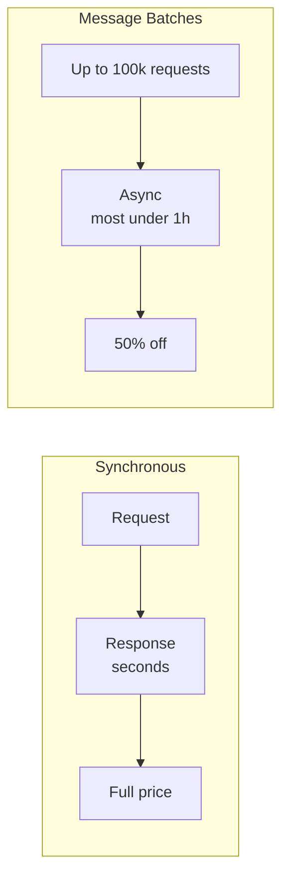
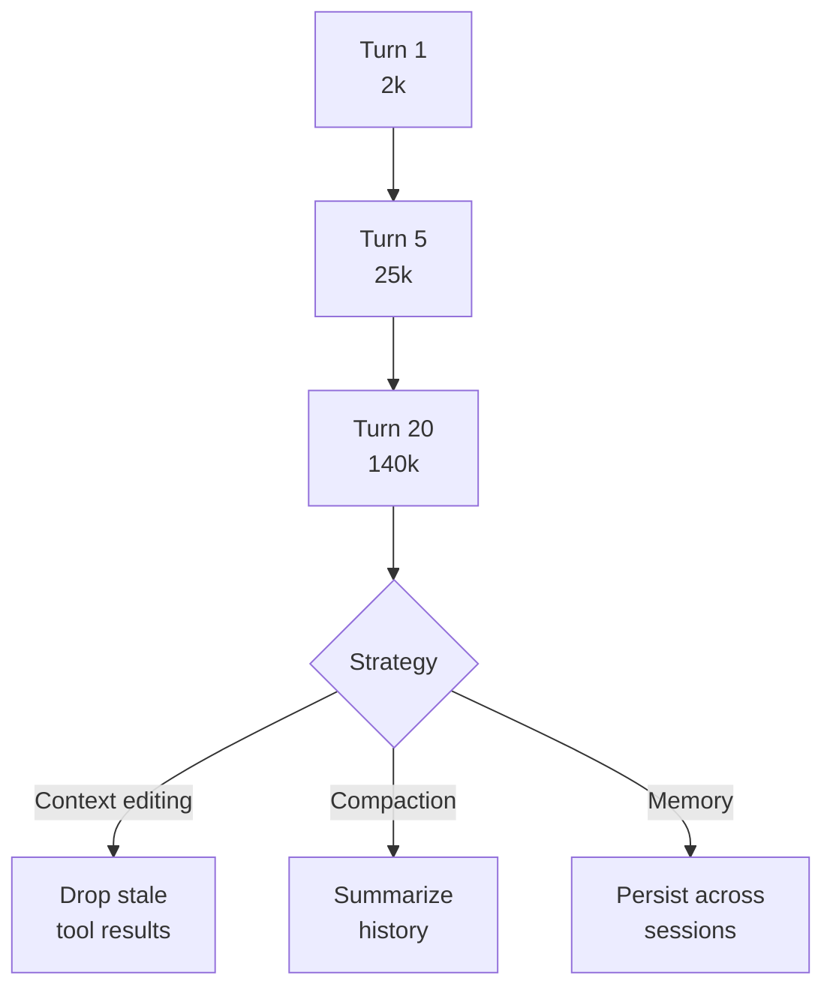
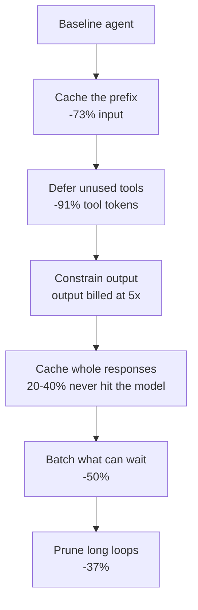

# How to Cut API Costs Without Compromising Agent Reliability

Six levers, ordered by how much they save relative to how hard they are to ship.
Two are live demos in this repo; four are slide material.

> **The whole talk in one sentence:** there are only three ways to cut LLM cost —
> send fewer tokens, pay less per token, or don't send the request at all.
> Everything below is one of those three.

---

## The number that reframes everything

Output tokens cost **5x** input tokens. On every current model.

| Model | Input / MTok | Output / MTok | Ratio |
|---|---|---|---|
| Claude Opus 5 | $5 | $25 | 5x |
| Claude Sonnet 5 | $3 | $15 | 5x |
| Claude Haiku 4.5 | $1 | $5 | 5x |
| Qwen3-Coder-Plus | $1 | $5 | 5x |

**A 500-token rambling answer costs the same as 2,500 tokens of input.**

Most teams obsess over trimming prompts and never look at response length. Both
matter, but only one of them is billed at 5x.

---

## Lever 1 — Prompt caching *(live demo)*

Cache the part of the prompt that never changes. Pay 10% for it on every
request after the first.

### The economics

| | Write cost | Read cost | Breaks even after |
|---|---|---|---|
| 5-minute TTL | 1.25x | 0.1x | 2 requests |
| 1-hour TTL | 2.0x | 0.1x | 3 requests |

### Measured live in this repo (Qwen, 4 questions)

| Mode | Cache reads | Hit rate | Cost |
|---|---|---|---|
| No cache | 0 | 0.0% | $0.005638 |
| Standard (implicit) | 3,072 | 65.4% | $0.002777 |
| Explicit `cache_control` | 4,596 | **97.9%** | **$0.001502** |

**73% cost reduction. Same model, same questions, same answers.**

### The rule that governs everything

**Caching is a prefix match.** One byte changes anywhere in the prefix and
everything after it is invalidated. Render order is `tools` → `system` → `messages`.

Silent cache killers to grep for:

- `Date.now()` / `datetime.now()` in the system prompt
- `randomUUID()` or request IDs early in content
- `JSON.stringify` without sorted keys
- Conditional system prompt sections
- A tool list that varies per user

If `cache_read_input_tokens` is 0 across repeated requests, one of these is why.

### Two gotchas worth saying out loud

**The first call is more expensive, not less.** It pays the 1.25x write. The
saving starts on call two. Warm the cache before you demo it.

**Some providers cache implicitly and you cannot turn it off.** Qwen's implicit
cache is on by default, which is why the naive "before" in this demo needs a
unique prefix injected just to get an honest 0% baseline.

---

## Lever 2 — MCP tool loading *(live demo)*

Every connected MCP server dumps its tool definitions into context **before
Claude does any work**.

### Measured live in this repo (Sonnet 5, 35 real tools across 4 servers)

| Mode | Tools in context | First-turn input | Cost |
|---|---|---|---|
| Load everything | 35 / 35 | 20,184 | $0.2208 |
| Tool search | 2 / 35 | **1,815** | **$0.0470** |

**91% fewer tool-loading tokens. 79% lower cost.**

### It is not just cost — it is accuracy

Tool selection degrades badly past **30–50 tools**. Anthropic's published
MCP evaluation numbers:

| Model | All tools loaded | With tool search |
|---|---|---|
| Opus 4 | 49% | **74%** |
| Opus 4.5 | 79.5% | **88.1%** |

This is the core claim of the talk: cost went **down** and reliability went **up**.

### The counterintuitive finding

Deferring *everything* is much worse than deferring *most*:

| Config | First-turn input | Cost |
|---|---|---|
| Load everything | 20,184 | $0.220 |
| Defer all 35 | 16,052 | $0.150 |
| Defer all but 3–5 | **1,815** | **$0.046** |

With everything deferred Claude runs multiple searches and pulls in large result
sets. Keep your 3–5 most-used tools loaded.

### How it composes with Lever 1

Deferred tools are appended **inline in the conversation**, not in the prefix.
The cached prefix survives. Under the old model, changing the tool set
invalidated the entire cache — tools render at position 0, ahead of everything.

> A tool with `defer_loading: true` cannot also carry `cache_control` — that is a
> 400. Put the breakpoint on a tool you are not deferring.

---

## Lever 3 — Output discipline

The 5x lever, and the one most teams never touch.

Three things that work:

**Structured outputs.** `output_config.format` with a JSON schema. The model
emits fields, not paragraphs. Removes preamble, hedging, and restatement.

**Explicit length constraints.** "Answer in under 40 words" is a cost control,
not a style preference.

**Effort control.** `output_config: { effort: "low" }` on routine work. Fewer,
more consolidated tool calls; less preamble; terser confirmations. Reach for
`high` or `xhigh` only when correctness genuinely matters.

> Watch for the interaction: `max_tokens` is a hard ceiling the model cannot
> see, so it truncates mid-thought and you pay for a retry. A **task budget**
> (`output_config.task_budget`) is advisory — the model paces itself and lands
> gracefully.

---

## Lever 4 — Don't send the request at all

The largest saving available, and invisible in most cost dashboards because the
request never appears on the bill.

**Response caching.** Hash the normalized request; serve stored answers on a hit.
Support and FAQ workloads see **20–40% hit rates** because people genuinely ask
the same things. Note this is *not* prompt caching — the model is never invoked.

**Semantic caching.** Embed the request, match on cosine similarity above a
threshold. Catches "how do I cancel" vs "I want to cancel my plan". Higher hit
rate, but a bad threshold serves confidently wrong answers — tune it carefully.

**Deterministic pre-filters.** "What is my balance?" is a database query, not an
LLM call. Rules and validation should resolve what they can before any model runs.

---

## Lever 5 — Batch API

**50% off. Flat. No prompt changes. No quality loss.**

Send anything not latency-sensitive here: overnight classification, backfills,
evals, summarization pipelines, bulk enrichment.

| Property | Value |
|---|---|
| Discount | 50% on input **and** output |
| Typical completion | under 1 hour |
| Hard expiry | 24 hours |
| Results retained | 29 days |

**It stacks with prompt caching.** Both discounts apply together. Observed cache
hit rates in batches run 30–98% depending on traffic shape.

> Because batches can take longer than 5 minutes, use the **1-hour cache TTL**
> for shared context inside a batch. Results come back in **any order** — key
> them by `custom_id`, never by position. `max_tokens: 0` is not supported.

---

## Lever 6 — Context lifecycle in long agent loops

In a long-running agent, old tool results eventually dominate the context window.
You re-send them on every turn.

| Strategy | What it does | When |
|---|---|---|
| **Context editing** | Clears old tool results (`clear_tool_uses_20250919`) or thinking blocks | Tool results are bulky and stale |
| **Compaction** | Summarizes earlier context server-side | Approaching the context limit |
| **Memory** | Claude reads/writes a memory directory | State must survive across sessions |

**Programmatic tool calling** belongs here too: Claude calls tools from inside
code execution, so intermediate results go to the running script instead of the
context window. Only the final output reaches the model. Anthropic measured
**43,588 → 27,297 tokens (37% reduction)** with accuracy *improving* from
46.5% to 51.2% on GIA.

> Compaction returns a block you **must** pass back. Append `response.content`,
> not just the extracted text, or you silently lose the compaction state.

---

## Mentioned, not demoed: model routing

Route by task complexity instead of defaulting to the biggest model.

**Why it is not a headline lever:** routing *shifts* spend rather than removing
work. An LLM classifier adds a call to every request, and its cost eats the
margin. Worse, **caches are model-scoped** — routing across models fragments
your cache, so Lever 1 and naive routing actively fight each other.

**Where it does work:** deterministic sub-task routing. Not "classify every
request", but "the extraction step in this pipeline is a Haiku job." No
classifier overhead, no cache fragmentation.

---

## Putting it together

These **compose**. Caching applies to what tool search leaves in the prefix.
Batch discounts stack on cached reads. Response caching removes requests before
any of it runs.

### Order of operations

1. **Batch API** — one flag, 50%, zero risk. Do this first.
2. **Prompt caching** — one breakpoint, ~70%+ on repeated prefixes.
3. **Response caching** — real engineering, but removes requests entirely.
4. **Tool search** — if you have more than 10 tools or 10k tokens of definitions.
5. **Output discipline** — cheap to try, 5x multiplier.
6. **Context lifecycle** — only once loops actually run long.

### The three claims to land

1. **Output costs 5x input.** Most teams optimize the cheap half.
2. **Cheaper and more reliable are not opposites.** Tool search cut cost 79% and
   raised tool-selection accuracy from 49% to 74%.
3. **Measure, do not assume.** Qwen's implicit cache made a naive before/after
   read as a 0.4% *loss*. Qwen also returns HTTP 200 for `defer_loading` while
   silently ignoring it. Always read `usage` back from the API.

---

## Demo runbook

**Section 01 — Prompt caching** (Qwen, `LLM_PROVIDER=qwen`)
Warm the cache first: the first explicit call pays 1.25x and shows 0% hit rate.
Click a question twice before switching modes.

**Section 02 — MCP tooling** (Anthropic, `MCP_MODEL_ID=claude-sonnet-5`)
Run the *same* question in both modes to reveal the side-by-side card. Expect
different tools to be chosen — search surfaces a relevant set, not an identical
one. The first-turn measurement is taken before any tool runs, so the comparison
stays valid.

---

## Sources — open these live

Every link verified reachable. Ordered to match the talk.

### Pricing — the 5x claim

| | |
|---|---|
| [Anthropic pricing](https://platform.claude.com/docs/en/about-claude/pricing) | Input vs output per model. **Open this for the 5x moment.** |
| [OpenAI pricing](https://platform.openai.com/docs/pricing) | Same 5x-ish ratio, different vendor |
| [Alibaba Model Studio pricing](https://www.alibabacloud.com/help/en/model-studio/model-pricing) | Qwen rates, tiered by input length |

### Lever 1 — Prompt caching

| | |
|---|---|
| [Anthropic — Prompt caching](https://platform.claude.com/docs/en/build-with-claude/prompt-caching) | `cache_control`, TTLs, breakpoints, the 1.25x/2x/0.1x economics |
| [OpenAI — Prompt caching](https://platform.openai.com/docs/guides/prompt-caching) | Automatic, 1024-token minimum, `cached_tokens` |
| [Qwen — Context cache](https://www.alibabacloud.com/help/en/model-studio/context-cache) | **Implicit vs explicit.** The page that explains why the naive baseline fails |

> Good side-by-side: all three vendors converged on ~0.1x for cache reads, but
> only Anthropic and Qwen let you place the breakpoint yourself.

### Lever 2 — MCP tooling

| | |
|---|---|
| [Tool search tool](https://platform.claude.com/docs/en/agents-and-tools/tool-use/tool-search-tool) | `defer_loading`, the ~85% figure, why the prefix survives |
| [MCP connector](https://platform.claude.com/docs/en/agents-and-tools/mcp-connector) | `mcp_toolset`, `default_config`, allowlist/denylist |
| [Advanced tool use](https://www.anthropic.com/engineering/advanced-tool-use) | **The 49% → 74% accuracy numbers.** Best single link of the talk |
| [MCP specification](https://modelcontextprotocol.io/introduction) | What MCP actually is, for anyone unfamiliar |

### Lever 3 — Output discipline

| | |
|---|---|
| [Structured outputs](https://platform.claude.com/docs/en/build-with-claude/structured-outputs) | `output_config.format` — schema instead of prose |

### Lever 5 — Batch API

| | |
|---|---|
| [Anthropic — Batch processing](https://platform.claude.com/docs/en/build-with-claude/batch-processing) | 50%, under 1h, stacks with caching |
| [OpenAI — Batch API](https://platform.openai.com/docs/guides/batch) | Also 50%, 24h window |

### Lever 6 — Context lifecycle

| | |
|---|---|
| [Context editing](https://platform.claude.com/docs/en/build-with-claude/context-editing) | `clear_tool_uses_20250919` |
| [Programmatic tool calling](https://platform.claude.com/docs/en/agents-and-tools/tool-use/programmatic-tool-calling) | The 37% reduction |
| [Effective context engineering](https://www.anthropic.com/engineering/effective-context-engineering-for-ai-agents) | The just-in-time retrieval principle underneath Levers 2 and 6 |

